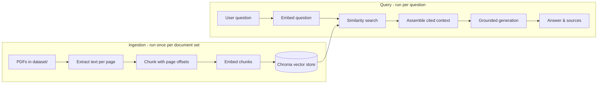

# Clinical Guidelines Assistant

A retrieval-augmented generation (RAG) system that answers natural-language questions grounded in a set of medical guidelines, journals and regulations, with every claim cited back to its exact source document and page number.

**Stack:** Gemini API (embeddings and generation) | ChromaDB (local vector store) | Streamlit (UI)

## How it works



### Steps
1. **Ingest** (`src/ingest.py`): Loads every PDF in `dataset/`, splits it into text chunks that overlap, maps each chunk back to the page(s) it came from, embeds the chunks with Gemini embedding, and stores the vectors, text and metadata (source, page, chunk index) in a local Chroma vector store.
2. **Retrieve** (`src/retrieve.py`): Embeds the user's question with the same model, and pulls the top-k (set to 5 but variable) most similar chunks from Chroma.
3. **Generate** (`src/generate.py`): Passes the retrieved chunks and the question to Gemini with a system prompt that forces it to answer *only* from the provided context and cite each claim as `[source_name, p.PAGE]`. This is what keeps answers grounded instead of hallucinated guesses that sound confident.
4. **App** (`app.py`): a Streamlit interface. When you type a question you get an answer, and you're able to expand each source to see exactly which page it was grounded in as well as the passage.


## Project structure

```
<project-root>/
├── dataset/                 # Source PDFs, drop your documents here
├── src/
│   ├── config.py            # Configuration settings for the solution
│   ├── ingest.py            # Loads, chunks, embeds, and stores documents
│   ├── retrieve.py          # Embeds a query and fetches top-k chunks
│   └── generate.py          # Builds the grounded prompt and calls Gemini
├── app.py                   # Streamlit UI
└── .chroma_store/           # Vector store which is automatically created
```

## Setup

1. **Get a free Gemini API key**: https://aistudio.google.com/apikey

2. **Install dependencies**:
   ```
   pip install -r requirements.txt
   ```

3. **Add your API key** to a `.env` file in the project root:
   ```
   GEMINI_API_KEY=your_key_here
   ```

4. **Add source documents**: drop PDFs into `dataset/`.

5. **Run ingestion**:
   ```
   python src\ingest.py
   ```
   The process is able to handle interruption (e.g. a rate limit), re-running it resumes from where it left off instead of re-embedding everything.

6. **Launch the app**:
   ```
   streamlit run app.py
   ```

## Configuration

All tunable settings live in `src/config.py`:

| Setting | Value                   | Purpose |
|---|-------------------------|---|
| `EMBEDDING_MODEL` | `gemini-embedding-001` | Model used to embed both documents and queries |
| `GENERATION_MODEL` | `gemini-3.5-flash-lite`      | Model used to generate the final answer |
| `CHUNK_SIZE` | `1000`                  | Characters per chunk |
| `CHUNK_OVERLAP` | `150`                   | Overlap between consecutive chunks, to avoid splitting an answer across a chunk boundary |
| `TOP_K` | `5`                     | Number of chunks retrieved per query |

Rate-limiting behaviour is tuned at the top of `src/ingest.py`:

| Setting | Current value | Purpose |
|---|---|---|
| `BATCH_SIZE` | `10` | Chunks embedded per API call |
| `REQUESTS_PM` | `90` | Target requests/minute the adaptive limiter paces to |
| `MAX_RETRIES` | `5` | Retry attempts on a short (per-minute) rate limit before giving up |
| `LONG_WAIT_THRESHOLD_SECONDS` | `60` | A Retry-After above this is treated as a longer-cycle (e.g. daily) quota rather than something worth retrying inline |


## Known limitations / possible improvements

- **No conversation memory**: each question is answered independently; there's no multi-turn follow-up handling in the current build.
- **LangChain implementation**: the pipeline is built directly on the Gemini SDK and the Chroma client rather than a framework. `PyPDFLoader`, `RecursiveCharacterTextSplitter`,`GoogleGenerativeAIEmbeddings`, and `RetrievalQA`/`create_retrieval_chain` are the natural LangChain equivalents of the ingestion/retrieval/generation steps here, if migrating.
- **Chunking is character-based**, not sentence/paragraph-aware. A splitter that respects sentence boundaries could improve retrieval quality (LangChain).